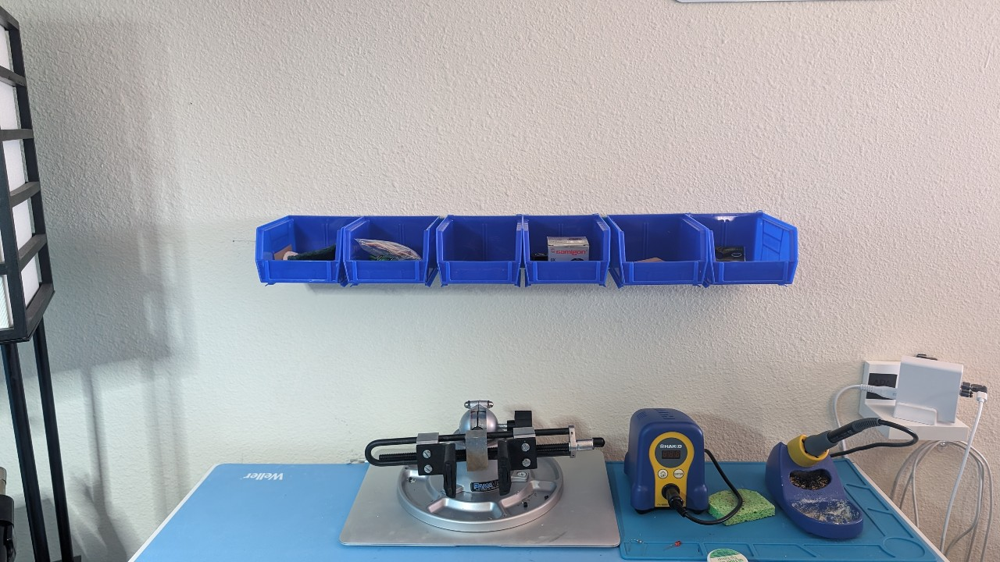
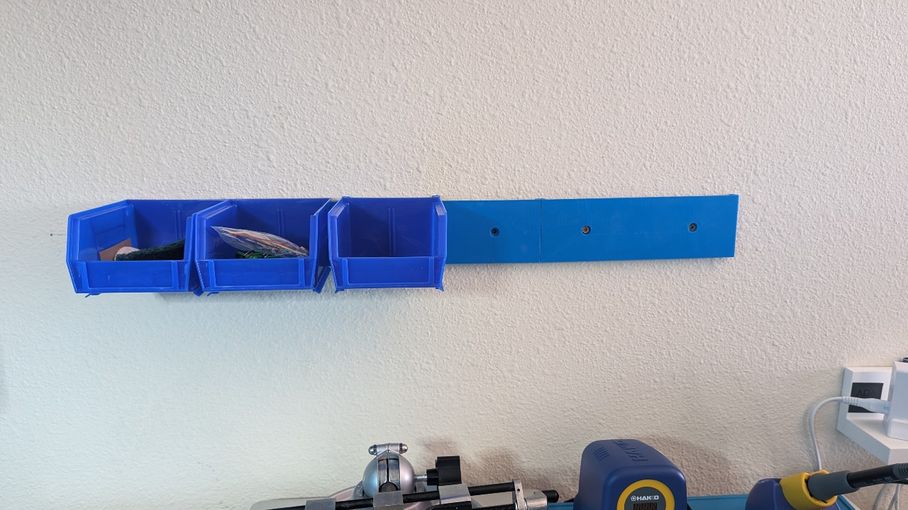
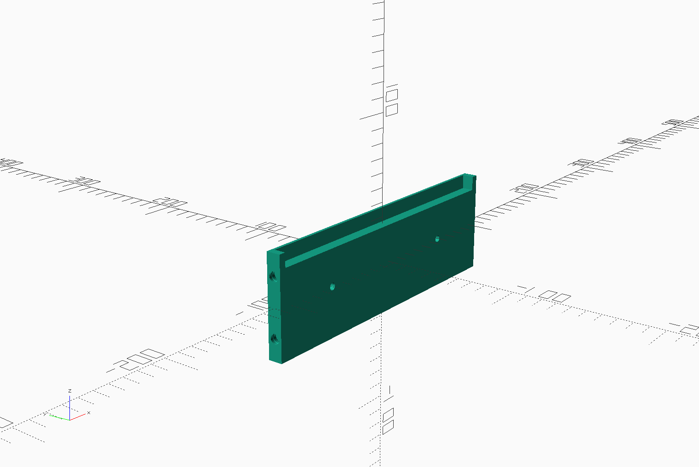

# Two Bin Expandable Akrobins Hangers

## The What

These are small hangers for your Akrobins that you can attach anywhere. Each hanger will hold two Akrobins.

## The Why

To start off, I don't have a ton of bins - yet. And since these are being used in my office/workshop I didn't want to
get one of the industrial-sized ones you see for purchase in most stores.

With this design, I can add on new rails when and where I need.

## The Design

It's a basic design. The hanger rail can hold two bins. The bins can be removed/replaced as needed. If you want to have
more than two bins hung side-by-side you can print additional hanger rails and secure them together with pins. 
Pins library provided by [tbuser](https://github.com/tbuser/pin_connectors).

The mounting holes are countersunk so that the mounting screws don't interfere with the bins when hung on the rail.
Library for the mounting holes provided by [mmalecki](https://github.com/mmalecki/catchnhole)

## The Execution

Designed in OpenSCAD with the intent to be configurable. My 3D printer
can only support up to 220mm x 200mm x 250mm print size; which is why I went with two bins per rail. You can change the
dimensions to suit your printer. 

Printed on a FlashForge Adventurer 4 using:
* PrintLife Pro PLA
* Bed Temp: 50c
* Nozzle Temp: 220c
* Supports: Yes, auto - I wanted the front of the pate to look good, if I had flipped it to avoid supports it wouldn't 
have looked nice because I probably need to replace my plate :)
  * Supports Type: Line
  * Pillar Size: 1.5mm
  * Touch Platform Only
  * Space to Model (X/Y) - Slicer: 70mm 
* Raft: Optional _It's a personal decision_
* Infill: Line
* Fill Density: 10%